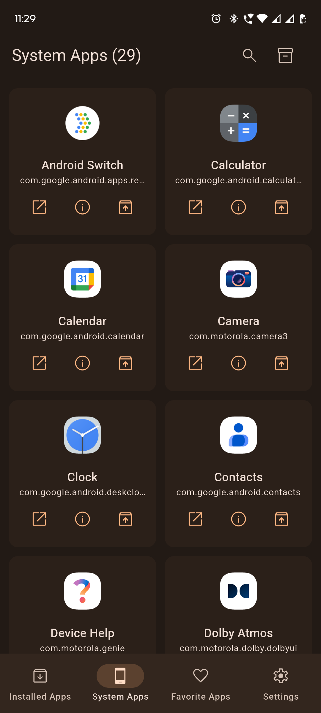
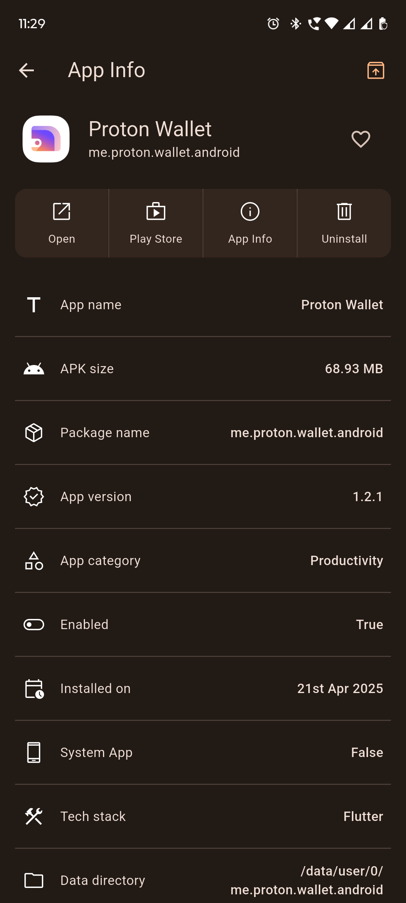
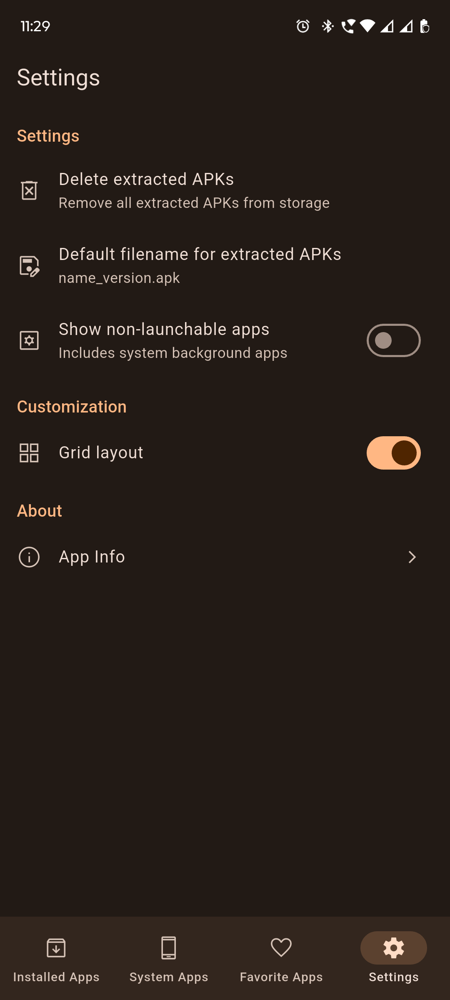

# Dexify - App Extractor for Android

**Dexify** is a modern, privacy-friendly APK extractor built with Flutter and Material 3. It lets you effortlessly browse installed apps, extract APKs with custom naming, and switch between grid or list layouts, all without ads or bloat.

## Installation

#### Clone the repository using the following command:

```bash
git clone https://github.com/iamkartiknayak/dexify.git
```

#### Navigate to the project directory:

```bash
cd dexify
```

```bash
flutter pub get
```

#### Run the application:

```bash
flutter run
```

## Features

- View all installed applications

- Display system apps separately

- View background-running apps with a toggle

- Detect and display the build platform (e.g. Flutter, Native, Unity etc) of each app

- Extract APKs to local storage

- Batch extract APKs using multi-select

- Choose a custom APK filename pattern for exports

- Switch between GridView and ListView layouts

- 100% ad-free with a clean Material 3 UI

- Dynamic theming (Material You support)

## Screenshots

&nbsp;&nbsp;&nbsp;
&nbsp;&nbsp;&nbsp;
&nbsp;&nbsp;&nbsp;
&nbsp;&nbsp;&nbsp;
<br><br>

### License

This project is licensed under the GPL3 License.

### Acknowledgements

The development of this app was made possible by the Flutter community's extensive resources. Special thanks to all those who contribute to the Flutter framework and its ecosystem.

Stay healthy and enjoy using the dexify app!
